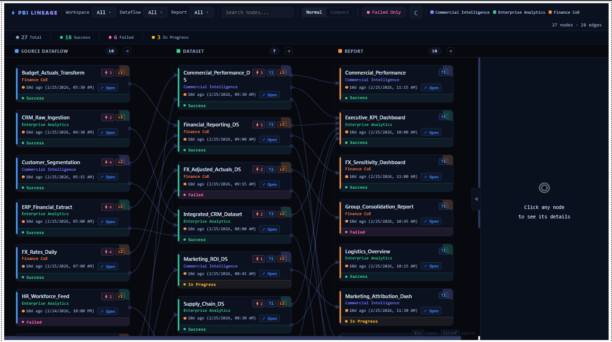
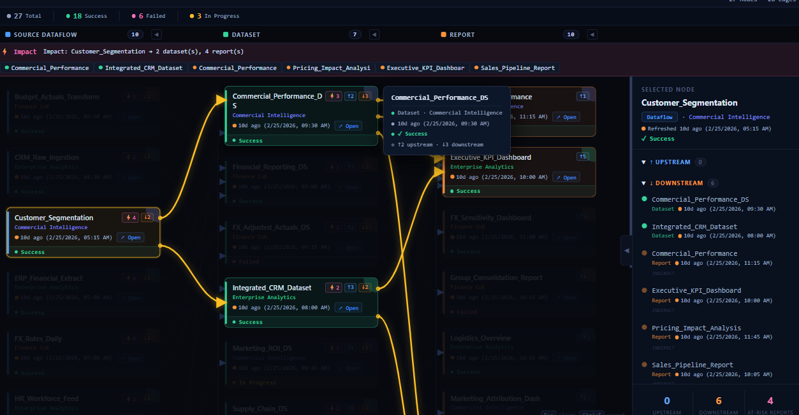
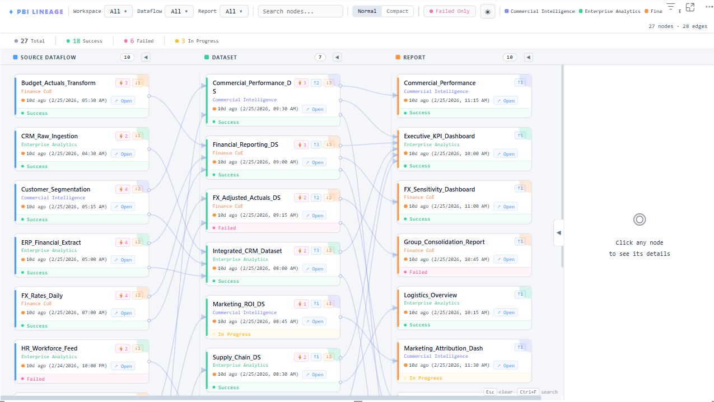

# PBI Lineage Explorer

[](https://buymeacoffee.com/snlshetty87)

A Power BI custom visual that renders an interactive, topological lineage graph showing how Dataflows, Datasets, and Reports connect across your Power BI tenant.

---

## Features

- **Topological stage layout** — nodes arranged left-to-right by dependency depth
- **S-curve edges** with directional arrows
- **Workspace, Dataflow, and Report filters** with live search and workspace subtitle
- **Node search** — filter cards by name
- **Click a node** to highlight its full upstream/downstream lineage
- **Right panel** — upstream/downstream list with direct/indirect indicators
- **Impact bar** — shows how many datasets and reports depend on a selected node
- **Refresh status** — Success / Failed / In Progress badges with relative timestamps
- **Stage collapse** — collapse any pipeline stage column
- **Normal / Compact** view toggle
- **Failed Only** filter
- **Workspace color legend**

---

## Screenshots

**Main View**


**Node Details**


**Light Theme**

---

## Quick Start

### Option A — Use the pre-built visual (easiest)

1. Download the latest `.pbiviz` file from the [Releases](https://github.com/SNLSHETTY87/PBI-Lineage-Explorer/releases) page of this repository
2. In Power BI Desktop or Service: **Insert > More visuals > Import from file**
3. Select the `.pbiviz` file
4. Follow the [DAX Setup](#dax-setup) steps below

### Option B — Build from source

```bash
# Prerequisites: Node.js 18+, npm
npm install -g powerbi-visuals-tools

# Clone and install
git clone <this-repo-url>
cd LineageVisualPBI
npm install

# Dev server (hot reload in Power BI)
npm run start

# Production package
npm run package
# Output: dist/LineageVisualPBI*.pbiviz
```

---

## Data Setup

The visual requires a **single flat table** added to your Power BI model.

### Required Table Schema

You need one table with the following concept representing a lineage connection between an upstream node (Source) and a downstream node (Target).

| Field Type | Required | Description |
|---|---|---|
| `sourceId` | Yes* | Globally unique ID for the upstream item. *Required only if a source node exists. |
| `sourceName` | No | Display name of the upstream item |
| `sourceType` | No | Exactly: `Dataflow`, `Dataset`, or `Report` |
| `sourceWs` | No | Workspace display name for the upstream item |
| `sourceStatus` | No | One of: `success`, `failed`, `progress` |
| `sourceTime` | No | Last successful refresh timestamp for the upstream item |
| `sourceUrl` | No | Direct URL to the item in Power BI Service |
| `targetId` | Yes* | Globally unique ID for the downstream item. *Required only if a target node exists. |
| `targetName` | No | Display name of the downstream item |
| `targetType` | No | Exactly: `Dataflow`, `Dataset`, or `Report` |
| `targetWs` | No | Workspace display name for the downstream item |
| `targetStatus` | No | One of: `success`, `failed`, `progress` |
| `targetTime` | No | Last successful refresh timestamp for the downstream item |
| `targetUrl` | No | Direct URL to the item in Power BI Service |

> A sample Excel file (`PBI_Lineage_SampleData.xlsx`) with the correct column structure is included in this repo. Import it into Power BI to see how the single flat table works.

### Step 1 — Add the visual to your report

1. Add the **PBI Lineage Explorer** visual to a report page
2. In the **Fields** pane, map the `sourceId`, `sourceName`, `sourceType`, `sourceWs`, etc. to their respective placeholders under **Source Data** and **Target Data**.
3. The lineage graph will render automatically!

---

## Sample Data

`PBI_Lineage_SampleData.xlsx` contains two sheets:

| Sheet | Description |
|-------|-------------|
| `Nodes` | Sample nodes (Dataflows, Datasets, Reports) across multiple workspaces |
| `Edges` | Sample dependency edges between nodes |

Import both sheets into your Power BI model and connect them to get started immediately.

---

## NodeType Values

| Value | Colour | Represents |
|-------|--------|------------|
| `Dataflow` | Blue | Power BI Dataflows (Gen1 or Gen2) |
| `Dataset` | Green | Semantic models / Datasets |
| `Report` | Orange | Power BI Reports |

---

## RefreshStatus Values

| Value | Badge | Meaning |
|-------|-------|---------|
| `success` | Green | Last refresh succeeded |
| `failed` | Pink | Last refresh failed |
| `progress` | Yellow (animated) | Refresh currently running |
| *(blank)* | — | No refresh data |

---

## Keyboard Shortcuts

| Key | Action |
|-----|--------|
| `Ctrl+F` | Focus the search box |
| `Esc` | Clear selection, search, and failed filter |

---

## Project Structure

```
LineageVisualPBI/
├── src/
│   ├── visual.ts              # Main visual entry point + static DOM
│   ├── interfaces.ts          # NodeData, EdgeData types
│   ├── settings.ts            # Formatting settings
│   ├── renderer/
│   │   ├── Toolbar.ts         # Filter dropdowns with search
│   │   ├── CardBuilder.ts     # Node card renderer
│   │   ├── EdgeDrawer.ts      # SVG S-curve edge drawing
│   │   ├── LayoutEngine.ts    # Topological stage layout
│   │   ├── RightPanel.ts      # Upstream/downstream panel
│   │   ├── TooltipManager.ts  # Hover tooltips
│   │   └── ImpactBar.ts       # Impact analysis bar
│   └── utils/
│       ├── helpers.ts         # Color palette, escaping
│       └── graphUtils.ts      # Ancestor/descendant traversal
├── style/
│   └── visual.less            # All styles
├── capabilities.json          # Field well definitions
├── pbiviz.json                # Visual metadata
├── PBI_Lineage_SampleData.xlsx
└── Working PBI DAX Code HTML viewer.txt   # Standalone HTML version (no custom visual needed)
```

---

## Development

```bash
npm run start    # Dev server at https://localhost:8080 (enable in Power BI settings)
npm run package  # Build .pbiviz for distribution
npm run lint     # ESLint check
```

To test with the dev server in Power BI:
1. Go to Power BI Service → Settings → Enable developer visual
2. Add the **Developer Visual** from the visualization pane to a report

---

## Support

If you find this visual useful, consider supporting the project:

[](https://buymeacoffee.com/snlshetty87)

---

## Author

**Sunil Shetty** — snlshetty87@gmail.com

---

## License

MIT
